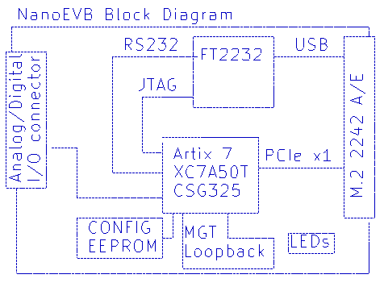
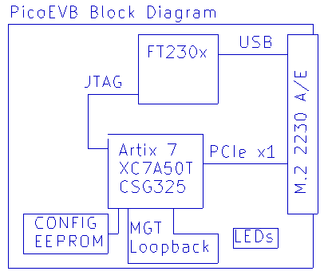

# NanoEVB-X1: M.2/NGFF based Xilinx development board

The NanoEVB-X1 is an affordable development board which can be used to evaluate and prototype 
PCI express designs using Xilinx Artix 7 FPGA on Windows or Linux hosts.
The board is designed around the Artix 7 (XC7A50T).

The NanoEVB-X1 is a complete development system in a M.2 (NGFF) 2242 footprint. The JTAG cable
and all necessary power supplies are built in. It will work in the following slots:
 
- M.2 2242 Key A
- M.2 2242 Key E
- Full length mini PCIe via an adapter [like this one](https://www.amazon.com/dp/B01MR76H5F)

## Features
- PCI Express connection to the host via M.2 edge slot
- Built-in JTAG cable works with Vivado and Labtools
- RS232 connection to the FPGA via FT2232
- Analog/digital IO

## Block Diagram

# PicoEVB-X1

The PicoEVB is a smaller version of the NanoEVB, shrunk to fit in a M.2 2230 slot.
The external I/O connector and spare uart have been removed to allow the fit into the following slots:

- M.2 2230 Key A
- M.2 2230 Key E
- Full length mini PCIe via an adapter [like this one](https://www.amazon.com/dp/B01MR76H5F)

## Features
- PCI Express connection to the host via M.2 edge slot
- Built-in JTAG cable works with Vivado and Labtools

## Block Diagram

## More information

[Check out the wiki](https://github.com/RHSResearchLLC/NanoEVB-X1/wiki)

or contact info@nanoevb.com

