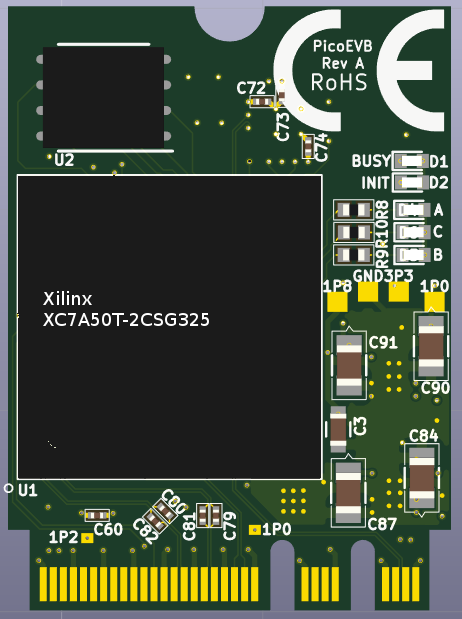
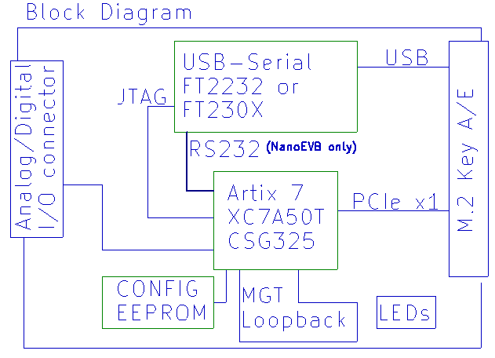

# PicoEVB: M.2/NGFF based Xilinx development board

PicoEVB is an affordable development board which can be used to evaluate and prototype 
PCI express designs using Xilinx Artix 7 FPGA on Windows or Linux hosts.
The board is designed around the Artix 7 (XC7A50T).

PicoEVB is a complete development system in a M.2 (NGFF) 2242 footprint. The JTAG cable
and all necessary power supplies are built in. It will work in the following slots:
 
- M.2 2230 Key A
- M.2 2230 Key E
- Full length mini PCIe via an adapter [like this one](https://www.amazon.com/dp/B01MR76H5F)
- PCIe x1, x4, x8, or x16 slot via an adapter [like this one](https://www.amazon.com/dp/B013U4401W) 

## Features
- PCI Express connection to the host via M.2 edge slot
- Built-in JTAG cable works with Vivado and Labtools
- Analog and digital IO

## Specifications

| Feature | PicoEVB |
| --- | --- |
| FPGA | Xilinx Artix XC7A50T |
| Form Factor | M.2 (NGFF) 2230, keyed for A and E slots |
| Dimensions | 22 x 30 x 3.8 mm |
| Host Interface | PCIe x1 gen 2 |
| Host Tools | Vivado 2016, 2017 |
| MGT Loopback | Yes |
| Built-in JTAG | Yes |
| External Interface | 4 digital channels OR 1 analog (differential) and 2 digital, OR 2 analog (differential) |
| User-controllable LEDs | 3 |

## Block Diagram

## How to get one
[Check us out on Crowd Supply](https://www.crowdsupply.com/rhs-research/nanoevb)

## More information

[Check out the wiki](https://github.com/RHSResearchLLC/NanoEVB-X1/wiki)

or contact info@nanoevb.com

Note: If you are looking for NanoEVB, it has been discontinued. The 2242 form factor 
of NanoEVB is rare, and the I/O connector has been added to PicoEVB, making NanoEVB redundant.

