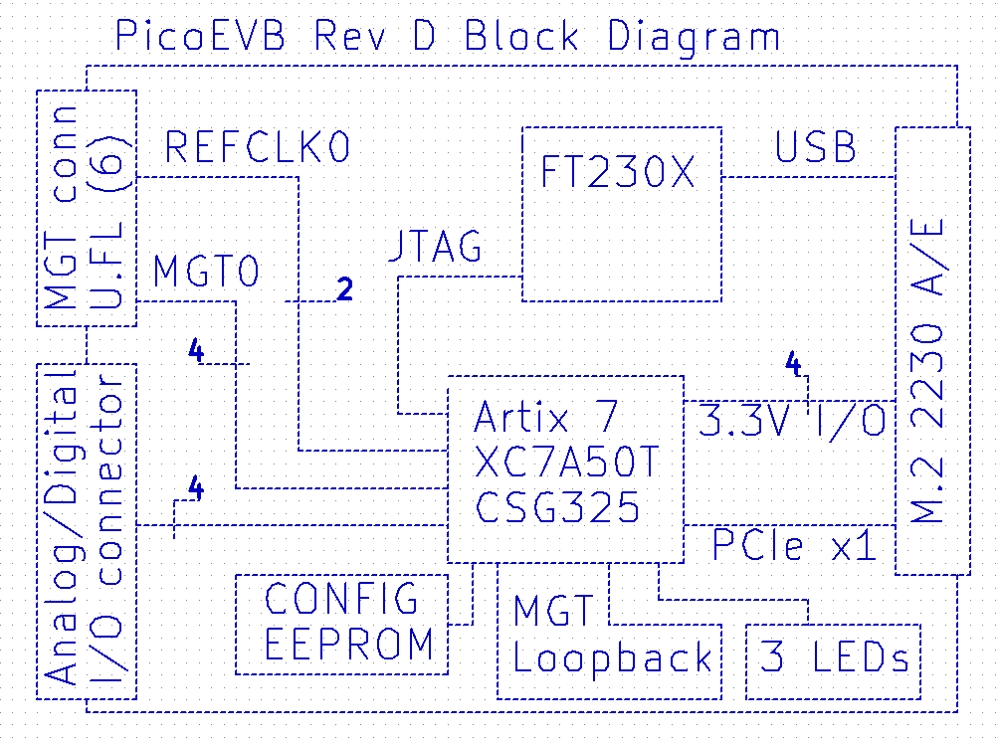
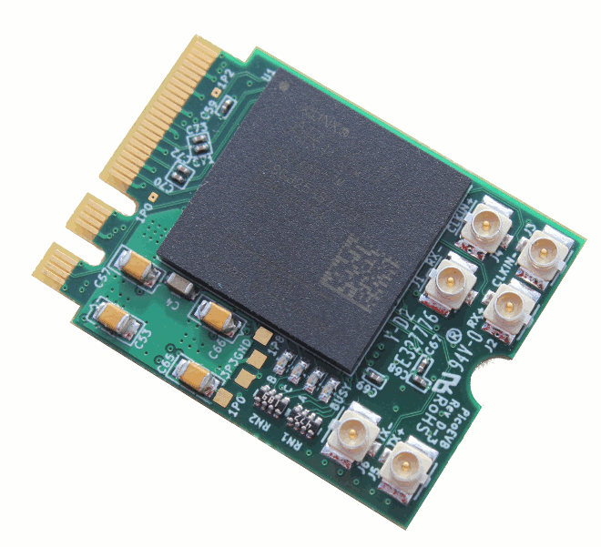

# PicoEVB: M.2/NGFF based Xilinx Artix-7 development board

PicoEVB is an affordable development board which can be used to evaluate and prototype 
PCI express designs using Xilinx Artix 7 FPGA on Windows or Linux hosts.
The board is designed around the Artix 7 (XC7A50T).

PicoEVB is a complete development system in a M.2 (NGFF) 2230 footprint. The JTAG cable
and all necessary power supplies are built in. It will work in the following slots:
 
- M.2 2230 Key A
- M.2 2230 Key E
- M.2 2280 Key M via an adapter [like this one](https://www.amazon.com/gp/product/B079NB8J3B)
- Full length mini PCIe via an adapter [like this one](https://www.amazon.com/dp/B01MR76H5F)
- PCIe x1, x4, x8, or x16 slot via an adapter [like this one](https://www.amazon.com/dp/B013U4401W) 

## Features
- PCI Express connection to the host via M.2 edge slot
- Built-in JTAG cable works with Vivado and Labtools
- Analog and digital IO

## Specifications

| Feature | Specification |
| --- | --- |
| FPGA | Xilinx Artix XC7A50T-2CSG325C |
| Form Factor | M.2 (NGFF), keyed for A and E slots |
| Dimensions | 22x30x3.8 mm |
| Host Interface | PCIe x1 gen 2 (5 Gb/s) |
| Host Tools | Vivado 2017.3 preferred |
| MGT Loopback | Yes |
| Built-in JTAG | Yes |
| External I/O configurations   via I/O connector | (digital+ differential analog)   4+0   2+1   0+2 |
| External I/O via PCIe connector | 4x 3.3V digital I/O (configurable) |
| External MGT connection | 1x MGT via U.FL connectors |
| External clock ref | 1x clkin via U.FL connectors |
| User-controllable LEDs | 3 |

## Block Diagram

## How to get one

- [Product Website](https://www.picoevb.com)
- [Amazon](https://www.amazon.com/dp/B0779PC8S4)
- [Crowd Supply](https://www.crowdsupply.com/rhs-research/nanoevb)
- [EBay](https://www.ebay.com/itm/232775706324)

## More information

- [Check out the wiki](https://github.com/RHSResearchLLC/NanoEVB-X1/wiki)
- [Product Website](https://www.picoevb.com)

or contact info@nanoevb.com

** Note: This page applies to PicoEVB Rev D. For previous revs, select the rev from tags ** 

