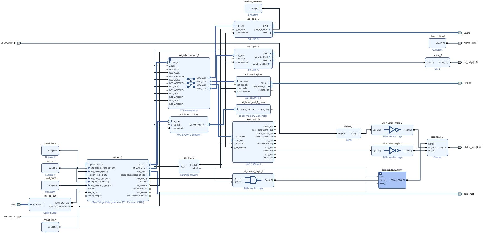

## This sample project demonstrates:
 - DMA transfer between block ram on FPGA and host PC, using PCIe x1, gen 2 (500MB/s)
 - Control LEDs on PicoEVB
 - Read/Control digital I/O on PicoEVB aux I/O connector
 - Read/Control digital I/O on PicoEVB PCIe edge connector

## Prerequisites:
 - This project uses Xilinx host-side DMA driver, so the driver must be installed and loaded. See https://github.com/Xilinx/dma_ip_drivers/tree/master/XDMA
 - There is also a Windows driver: https://www.xilinx.com/support/answers/65444.html

## Project details

Here is the Vivado block diagram that implements the project. The heavy lifting is done by Xilinx DMA/Bridge subsystem:

The 'B' LED indicates PCIe status:

| 'B' LED state | Meaning      |
| ---           | ---          |
|  Blinking     | PCIe link up |
|  Solid        | PCIe link in reset |
|  Off          | PCIe link failure |

The 'C' LED is under user control

The 'A' LED lights up if FPGA is overtemperature or one of the FPGA voltage rails are out of spec

### I/O map
When using the Xilinx XDMA driver, all communication between the FPGA and host SW happens via file read/writes.
To access the resources below, read/write to a device file (/dev/xdma0_user) at the given address:

| Address | Byte Length | Type | Description |
|  ---    |   ---       | ---  |      ---    |
| 0x1000  |  4          | R    | Version number     |
| 0x1008  |  4          | RW   | `aux IO pin` data    |
| 0x100C  |  4          | RW   | `aux IO pin` direction   0=output, 1=input |
| 0x2000  |  4          | RW   | `PCIe digital input` data  |
| 0x2004  |  4          | RW   | `PCIe digital input` direction   0=output, 1=input   **SHOULD BE INPUTS PER M.2 SPEC** |
| 0x2008  |  4          | RW   | `LEDs` |
| 0x200C  |  4          | RW   | direction register for above   0=output, 1=input   Must be set to 0 to control LEDs |
| 0x3000  |             | RW   | XADC. See PC091. Temperature is at this address + 0x200
| 0x10000 |             | RW   | AXI-SPI block for writing to onboard flash. See spi-loader utility

### Register details

`aux IO pin` data & direction registers:

| D31-D4 | D3    | D2    | D1    | D0    |
| ---    | ---   | ---   | ---   | ---   |
| unused | Pin 5 | Pin 4 | Pin 2 | Pin 1 |

`PCIe digital input` register (see the schematic for pinout of W_DISABLE_1, W_DISABLE_2):

| D31-D2 | D1    | D0    |
| ---    | ---   | ---   |
| unused |  W_DISABLE_2 | W_DISABLE_1 |

`LEDs` register (see the schematic for pinout of M2_LED_1, M2_LED_2):

| D31-D3 | D2    | D1       | D0       |
| ---    | ---   | ---      | ---      |
| unused | LED C | M2_LED_1 | M2_LED_2 |

### Running the programs

 - A sample program to blink all LEDs: Host/blink-leds.py
 - A sample program that transfers some data to/from the block ram on the FPGA: Host/dma-test.py
 - A sample program to report the FPGA bitstream version (as read from register @ 0x1000)
 - With the Xilinx xdma driver loaded, simply run the python script

These are python3 programs- they won't work properly with Python2

### Modifying the FPGA
See the readme in the FPGA folder for more information

### Notes for Windows users
For Windows users, there aren't any Python scripts that implement these examples.
Instead, the Xilinx-provided tools provide easy acccess to the resources.

`xdma_test.exe`: This will test the DMA between FPGA block ram and host PC

#### An example for controlling LEDs

Set the LED port pins to putput:
`xdma_rw.exe user write 0x100c 0 0 0 0`

Write all 1's to the LED port, to turn off the LEDs (LEDs are active low)
`xdma_rw.exe user write 0x1008 255 255 255 255`